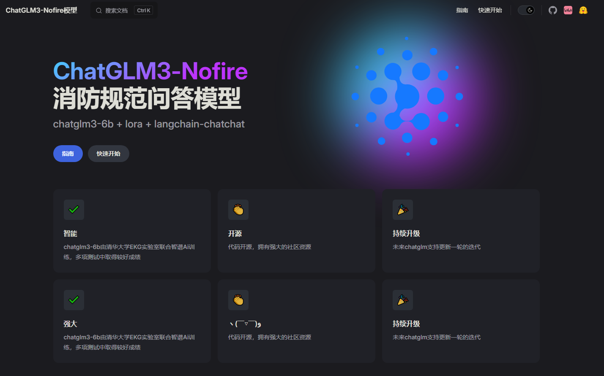

# 项目背景
> 大家都调侃说2023年是AI元年，不得不说AI在我们生活中逐渐扮演着越来越重要的角色，如何有效的把AI模型结合当前生产生活实际显得尤为重要，基于此并结合专业知识，我们想打造一款工业消防类型的AI知识库模型，在现有的AI模型基础之上，使用微调技术，收集所需数据集进行微调。

- 想法来源：

[校企合作！基于文心大模型共建水科学研究助手WaterScholar](https://mp.weixin.qq.com/s/_sJsjdp0sIcD0Vh5oqMMZA)

- 具体思考
> 市面上不缺乏各式各样的对话模型，但是都是基于底层AI大模型的调用，不能做到有针对性的回答某个非常细化的问题，所以说一个细化的AI知识库就显得尤为重要了，但是我们不可能从零开始去训练一个模型，不论是从技术，成本等等方面。随着 ChatGPT 的爆火，很多机构都开源了自己的大模型，比如ChatGLM-6B/ChatGLM-10B/ChatGLM-130B，HuggingFace 的 BLOOM-176B，LLAMA2，
> 这些大公司或者研究机构，都是有足够资源的来开发大模型，但是对于一般的小公司或者个人来说，要想开发自己的大模型几乎不可能，要知道像 ChatGPT 这样的大模型，一次训练的成本就在上千亿美元。
> 那么针对于小公司或者个人，我们怎么能够利用这些开源的大模型，在自己的数据上继续训练，从而应用于自己的业务场景？有没有低成本的方法微调大模型？
> 答案是有的。目前主流的方法包括2019年 Houlsby N 等人提出的 Adapter Tuning，2021年微软提出的 LORA，斯坦福提出的 Prefix-Tuning，谷歌提出的 Prompt Tuning，2022年清华提出的 P-tuning v2。
>  我选择的是**ChatGLM3-6B模型+LORA/**[**LLaMA-Factory**](https://github.com/hiyouga/LLaMA-Factory)**+**[**LangChain-Chatchat**](https://github.com/chatchat-space/Langchain-Chatchat)**，使用ChatGLM3-6B作为预训练模型，使用LORA和**[**LLaMA-Factory**](https://github.com/hiyouga/LLaMA-Factory)**微调框架，使用**[**LangChain-Chatchat**](https://github.com/chatchat-space/Langchain-Chatchat)**作为应用框架，整体的思路以上这些，下面是实现过程的一些记录，完整的内容可以查看我们推出的文档**

### ChatGLM3-6B介绍
**ChatGLM3** 是智谱AI和清华大学 KEG 实验室联合发布的对话预训练模型。ChatGLM3-6B 是 ChatGLM3 系列中的开源模型，在保留了前两代模型对话流畅、部署门槛低等众多优秀特性的基础上，ChatGLM3-6B 引入了如下特性：

1. **更强大的基础模型：** ChatGLM3-6B 的基础模型 ChatGLM3-6B-Base 采用了更多样的训练数据、更充分的训练步数和更合理的训练策略。在语义、数学、推理、代码、知识等不同角度的数据集上测评显示，* _ChatGLM3-6B-Base 具有在 10B 以下的基础模型中最强的性能_*。
2. **更完整的功能支持：** ChatGLM3-6B 采用了全新设计的 [Prompt 格式](https://github.com/THUDM/ChatGLM3/blob/main/PROMPT.md) ，除正常的多轮对话外。同时原生支持[工具调用](https://github.com/THUDM/ChatGLM3/blob/main/tools_using_demo/README.md)（Function Call）、代码执行（Code Interpreter）和 Agent 任务等复杂场景。
3. **更全面的开源序列：** 除了对话模型 [ChatGLM3-6B](https://huggingface.co/THUDM/chatglm3-6b) 外，还开源了基础模型 [ChatGLM3-6B-Base](https://huggingface.co/THUDM/chatglm3-6b-base) 、长文本对话模型 [ChatGLM3-6B-32K](https://huggingface.co/THUDM/chatglm3-6b-32k) 和进一步强化了对于长文本理解能力的 [ChatGLM3-6B-128K](https://huggingface.co/THUDM/chatglm3-6b-128k)。以上所有权重对学术研究**完全开放** ，在填写 [问卷](https://open.bigmodel.cn/mla/form) 进行登记后**亦允许免费商业使用**。

- 

## 关键事项

- 在人工智能蓬勃发展的今天，传统非结构化文本形式的规范已难以满足合规审查、关联分析等法规智能应用场景。
- 海量复杂的规范体系为建筑设计、建造及管理人员带来了极大的挑战，如何高效的检索、查询和利用消防规范中蕴含的知识和经验已成为当前亟待解决的难题之一。
- 目前，有关规范仍以传统 PDF 文档、网页等形式存储和管理，检索和利用效率低，已成为消防乃至建筑领域的智能化水平和转型升级的瓶颈。

